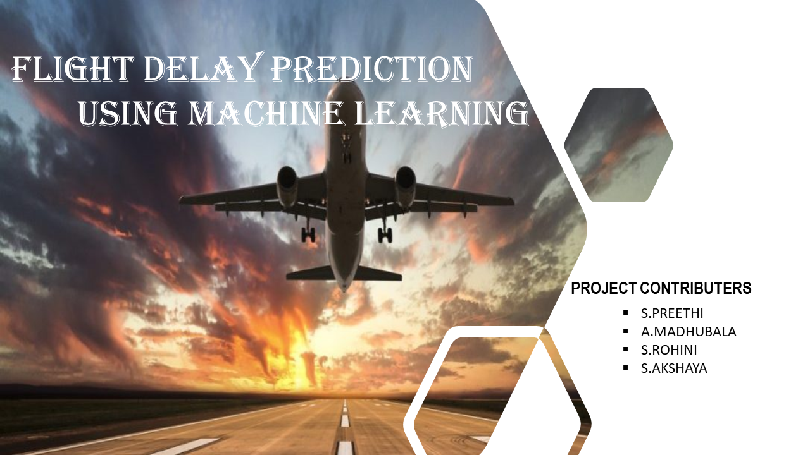

<h1 align="fill" >
 
</h1>

# 🛃 FLIGHT DELAY PREDICTION

- TECHNOLOGY : DATASCIENCE
- TEAM ID    : PNT2022TMID37576
- BATCH NO   : B3-3M5E

# 📒 PROJECT DESCRIPTION

An increase in air traffic growth has also resulted in massive levels of aircraft delays on the ground and in the air. 
These delays are responsible for large economic and environmental losses. 
The main objective of the model is to predict flight delays accurately in order to optimize flight operations and minimize delays.
Using a machine learning model, we can predict flight arrival delays. 
The input to our algorithm is rows of feature vector like departure date, departure delay, distance between the two airports, scheduled arrival time etc

 

 
# 👨🏻‍💻 SOFTWARE REQUIRED
- PYTHON
- FLASK
- DOCKER

 

 ## PROJECT STATUS - DEVELOPMENT STAGE

## 🈸 SKILLS REQUIRED
|    |   |   |
| :---:         |     :---:      |          :---: | 
| IBM CLOUD   | PYTHON     | PYTHON WEB FRAME WORKS   | 
| PYTHON - FLASK    | PYTHON FOR DATA VISUALIZATION    | DOCKER    |
| DATA PREPROCESSING TECHNIQUES| IBM WATSON STUDIO | MACHINE LEARNING |
| | | |

## 🧑🏻‍🦰 TEAM MEMBERS
- PREETHI S
- MADHUBALA A  
- ROHINI S
- AKSHAYA S

## 📒 ASSIGNMENT FINISHED
- [x] ASSIGNMENT 1
- [x] ASSIGNMENT 2
- [x] ASSIGNMENT 3 

## 🔗 LINKS

| TEAM MEMBERS | FOLDER LINK    |
| ------------- | ------------- |
| PREETHI S  | <button> <a href="https://github.com/IBM-EPBL/IBM-Project-1225-1658379233/tree/main/Assignments/Team%20Lead">CLICK HERE!  </a></button>                 
| MADHUBALA A | <button> <a href="https://github.com/IBM-EPBL/IBM-Project-1225-1658379233/tree/main/Assignments/Team%20Member%201">CLICK HERE!  </a> </button> |
| ROHINI S     | <button><a href="https://github.com/IBM-EPBL/IBM-Project-1225-1658379233/tree/main/Assignments/Team%20Member%202">CLICK HERE!  </a> </button> |
| AKSHAYA S    | <button><a href="https://github.com/IBM-EPBL/IBM-Project-1225-1658379233/tree/main/Assignments/Team%20Member%203">CLICK HERE!  </a> </button> |

## PROJECT DESIGN & PLANNING
# 🧩 IDEATION PHASE

      Ideation is the process where you generate ideas and solutions through sessions such as Sketching, Prototyping, Brainstorming, Brainwriting, Worst Possible Idea, and a wealth of other ideation techniques.
- [x] Literature Survey
- [x] Problem Statement
- [x] Empathy Map
- [x] Brainstorm

# 🧩 DESIGN PHASE 
      In the design phase, one or more designs are developed, with which the project result can apparently be achieved. Depending on the subject of the project, the products of the design phase can include dioramas, sketches etc

# DESIGN PHASE 01 ⚒️
- [x] Proposed Solution
- [x] Problem-Solution Fit
- [x] Solution Architecture

# DESIGN PHASE 02 ⚒️
- [x] Solution Requirements
- [x] Customer Journey Map
- [x] Data Flow Diagrams
- [x] Technology Stack

# PROJECT PLANNING PHASE
- [x] Prepare Milestone & Activity List
- [x] Sprint Delivery Plan

📫 How to reach Us <a href = "mailto:ibmdemo6@yahoo.com">Connect with Email</a>

 <h5> | `FLIGHT DELAY PREDICTION` |</h5>

